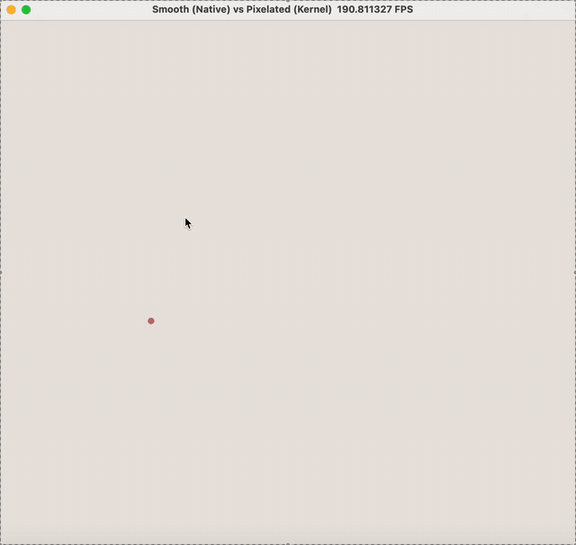

# 计算机图形学第三次实验报告： 基于 Taichi 的曲线生成与离散光栅化冲突研究

## 实验概述
**实验题目**：Bézier 与 B-Spline 曲线的生成及光栅化走样模拟

**开发环境**：Python 3.12 + Taichi 1.7.4 (arch=metal)

**核心致敬**：探讨数学上的完美连续曲线与计算机物理像素离散本质之间的视觉冲突。

## 1. 实验目的与核心任务
**数学建模**：实现经典的 Bézier 曲线与均匀三次 B-Spline 曲线的数学推导与生成。

**硬件加速**：利用 Taichi 的 GPU 并行计算能力，在屏幕上实时渲染成千上万个曲线采样点。

**现象展示**：通过极端光栅化模拟，直观展示连续几何图形在离散像素网格上的“走样（Aliasing）”现象，揭示抗锯齿（AA）技术存在的物理必要性。

## 2. 实验原理与数学公式推导

### 2.1 Bézier 曲线与 De Casteljau 算法
贝塞尔曲线的生成基于 De Casteljau 算法。对于 $n$ 个控制点 $P_i$，在参数 $t \in [0,1]$ 下，每一轮迭代产生的新点集为：

$$
P_i^{(k)} = (1-t)P_i^{(k-1)} + tP_{i+1}^{(k-1)}
$$

当迭代至只剩一个点时，即为曲线在该参数位置的坐标。其显式伯恩斯坦多项式（Bernstein Polynomials）形式为：

$$
P(t) = \sum_{i=0}^{n} \binom{n}{i} t^i (1-t)^{n-i} P_i
$$

### 2.2 均匀三次 B-Spline 曲线
相比于贝塞尔曲线“牵一发而动全身”的全局性，B 样条具有优秀的局部控制性。本实验采用均匀三次 B 样条，其基函数矩阵（Basis Matrix）如下。对于每段由 4 个控制点决定的曲线，其矩阵表示为：

$$
P(t) = \frac{1}{6}
\begin{bmatrix}
t^3 & t^2 & t & 1
\end{bmatrix}
\begin{bmatrix}
-1 & 3 & -3 & 1 \\
3 & -6 & 0 & 4 \\
-3 & 3 & 3 & 1 \\
1 & 0 & 0 & 0
\end{bmatrix}
\begin{bmatrix}
P_i \\ P_{i+1} \\ P_{i+2} \\ P_{i+3}
\end{bmatrix}
$$

## 3. 项目架构与模块设计
为了保证代码的健壮性与可维护性，本项目采用了**计算与渲染解耦**的架构设计。通过将CPU密集型的数学计算与GPU密集型的像素渲染分离，实现了高效的管线运作。

### 3.1 目录结构
```plaintext
work2/
├── main.py          # 核心程序：Taichi状态机、GPU内核及UI交互
└── math_core.py     # 数学核心：CPU 端的Bézier与B-Spline算法实现
└── videos           # 存放两个demo动图
    ├── 必做demo.gif
    └── 选做demo.gif           
```

### 3.2 模块职责划分

**math_core.py (计算层)**：负责在 CPU 端执行纯粹的数学运算。利用 NumPy 的向量化特性，高速生成曲线的离散采样点，降低 CPU 到 GPU 的数据传输频次。

**main.py (渲染与交互层)**：

【Taichi 显存管理】：开辟 pixels 缓冲区和 curve_points_field 顶点场。

【双渲染管线】：实现基于硬件的原生光滑 lines 绘制，与基于手写 Kernel 的巨型像素光栅化绘制。

【事件轮询】：捕捉键盘和鼠标点击，驱动 GUI 状态机。具体按键对应功能见下表⬇️

| 操作 | 功能 | 
| :---:| :----: |
| 鼠标左键 | 添加控制点 |
| 键盘 A | 切换光栅化走样显示模式 | 
| 键盘 B | 切换 B-Spline 曲线渲染 | 
| 键盘 C | 清空当前画面 | 

## 4. 实验过程与Demo演示
### 4.1 实验过程中的问题、Bug 分析与解决方案

在开发过程中，我遇到了三个极具图形学和编译器特征的典型问题。以下是我的分析与解决过程：

📸 **问题一：高分辨率屏幕导致的“天然抗锯齿”使实验对比不明显**

【现象描述】：在基础光栅化模式下，即便我关闭了所有平滑算法，在物理屏幕（尤其是高PPI的Retina屏幕）上，曲线的锯齿感依然微乎其微，很难观察到“阶梯状”的走样。

【原因分析】：屏幕的物理像素太小，导致1像素宽度的离散跳跃超出了肉眼的感知极限，达不到“教学演示”需要的强烈对比。

【解决方案】：我没有妥协于硬件，而是通过**“逻辑大像素（Super-Pixel）”**策略，在Kernel中将物理像素强行聚合为15x15或20x20的巨型方块。通过牺牲分辨率，我成功地将原本不可见的微小阶梯放大了数十倍，实现了震撼的视觉反差。

💻 **问题二：Taichi 编译器的闭包作用域解析错误**

【现象描述】：在替换 AA 内核代码时，终端报错 Name "curve_points_field" is not defined，指向全局变量未定义。

【原因分析】：排查后发现，我在内核函数上方不小心连续写了两个@ti.kernel 装饰器。Taichi在进行静态元编程和AST变换时，重复的装饰器破坏了函数的闭包属性，导致JIT编译器无法正确回溯到Python的全局作用域去解析外部定义的Taichi Field。

【解决方案】：清理冗余的装饰器，并规范Python PEP8的函数换行间距，确保Taichi的解析器能正确捕捉上下文。

🎨 **问题三：Taichi Canvas底层C++接口的类型兼容性报错**

【现象描述】：调用canvas.lines绘制原生光滑曲线时，控制台抛出TypeError: lines(): incompatible function arguments。

【原因分析】：错误提示显示参数类型不匹配。canvas.lines的底层是Taichi用 C++ 编写的高性能GGUI接口。它在接收颜色参数时，严格期待一个 Python的 tuple类型，而我直接传入了NumPy的浮点数组，导致跨语言类型绑定失败。

【解决方案】：在Python端将RGB颜色强行解包并转换为标准的Tuple。例如：将颜色变量定义为BEZIER_COLOR= (0.50, 0.60, 0.53)。问题随即解决。

### 4.2 Demo 演示

**必做作业：通过鼠标添加控制点绘制贝塞尔曲线，通过按键C进行页面的清除🆑**


默认启动后，绘制的贝塞尔曲线在 800x800 的物理屏幕上表现得如丝绸般光滑，展示了矢量数学模型的完美性。


**选做作业：通过按键A来切换贝塞尔反走样绘制&通过按键B来切换B样条曲线和贝塞尔曲线♻️**

按下A键后，连续的几何线条瞬间坍缩为由20×20物理像素组成的粗糙方块。在曲线斜率较大的地方，“像素跳跃”导致的锯齿阶梯清晰可见。

按下B键后，画面展示的是相同控制点下B样条曲线的形式。


## 5. 个人思考与实验总结
在本次实验中，我经历了一次深刻的认知迭代。起初，我尝试通过算法自带的反走样（AA）来实现平滑。但我很快发现，在MacBook这种极高PPI的 Retina 屏幕上，即便关闭AA，1像素宽度的锯齿由于太细微，肉眼也极难分辨。

我的创新性反向思考是：既然高分屏的物理特性掩盖了走样的缺陷，那我就“人为制造低分辨率”。

于是我设计了巨型像素内核。通过这种方式，我成功地将原本不可见的微小阶梯，放大了数十倍展示在屏幕上。这让我深刻体会到了图形学中一个经典浪漫的真理：屏幕上展现的平滑都是“欺骗”大脑的艺术，而方方正正的离散像素才是计算机冰冷的现实。 无论是超分辨率还是MSAA算法，本质上都是在用算力去弥补硬件离散化带来的信息丢失。
